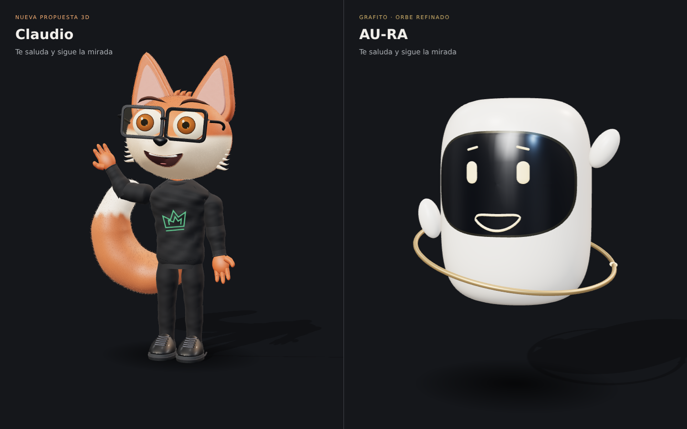

# Claude: comenzar aquí · Avatares 3D de AURA

Medardo pidió subir esta entrega al repositorio para que Claude continúe la integración. El paquete completo está en **[`vendor/aura-avatar-suite`](vendor/aura-avatar-suite/README.md)**.



## Estado de la entrega

- **ANT-ONIO v2 aprobado por Medardo.** Su GLB se conserva exactamente igual a la versión aceptada. No rehacer el diseño ni pedir de nuevo aprobación de ese mismo modelo.
- **Claudio:** propuesta nueva de zorro 3D con lentes ámbar, corona verde, pelaje, cola y expresiones.
- **AU-RA:** refinamiento 3D de la identidad vigente **Grafito · Orbe**.
- Cada GLB contiene **30 clips**. Los tres se validaron sin errores ni advertencias glTF.
- Se verificaron recarga de GLB, boca con reproducción real de audio, cierre al detener audio, puente de eventos y vista móvil de 390 px.
- Los adaptadores TSX se comprobaron sintácticamente; todavía no se compilaron dentro de la app ni se probaron en un Android físico.

Esta rama entrega recursos y adaptadores. No activa los nuevos avatares en producción, no cambia el cerebro de AURA y no conecta la voz definitiva.

## Qué abrir

1. **[Guía de integración](vendor/aura-avatar-suite/CLAUDE-INTEGRACION.md)**: rutas del código actual, contratos, decisiones y verificaciones pendientes.
2. **[Demo autónoma](vendor/aura-avatar-suite/AVATARES-AURA-DEMO.html)**: descargar y abrir en un navegador con WebGL; el visor de código de GitHub no ejecuta el HTML.
3. **[Video real de los modelos](vendor/aura-avatar-suite/AVATARES-AURA-PREVIEW.mp4)**.
4. **[Modelos GLB](vendor/aura-avatar-suite/assets)**: AURA-ORBE directo; ANT-ONIO y CLAUDIO se reconstruyen exactamente desde sus partes con `npm run restore-models`. El script verifica tamaño y SHA-256 y no requiere red.
5. **[Adaptadores](vendor/aura-avatar-suite/integration)**: React web, WebView móvil y HTML empaquetado sin conexión.

## Continuar

```sh
cd vendor/aura-avatar-suite
npm ci
npm run restore-models
npm test
npm run build
npm run validate
```

Leer primero las instrucciones vigentes de la rama y el código actual. Revisar `mobile/src/avatares/catalogo.ts`, `mobile/src/screens/DeskScreen.tsx`, `mobile/src/components/SalaAura.tsx`, `src/11-sala/VistaSala.tsx` y `src/11-sala/embed.ts`.

Añadir ANT-ONIO como opción sin renombrar los IDs existentes. Conservar los avatares actuales como recuperación ante fallo. La sala de AU-RA tiene silla, escritorio y tareas con objetos: este escenario de presentación no las sustituye. Integrar su nuevo cuerpo conservando esas funciones o mantener ambas vistas.

Mantener voces, sesiones, memoria, permisos y herramientas existentes. La voz futura de ANT-ONIO con ElevenLabs se configura en una etapa posterior. No incluir claves en cliente, APK, GLB o Git.

El acabado es estilizado y el rig usa nodos y morph targets, sin un archivo Blender ni esqueleto humanoide con piel ponderada. Medir memoria/FPS y comportamiento de audio en el teléfono objetivo antes de activar la nueva opción por defecto.
